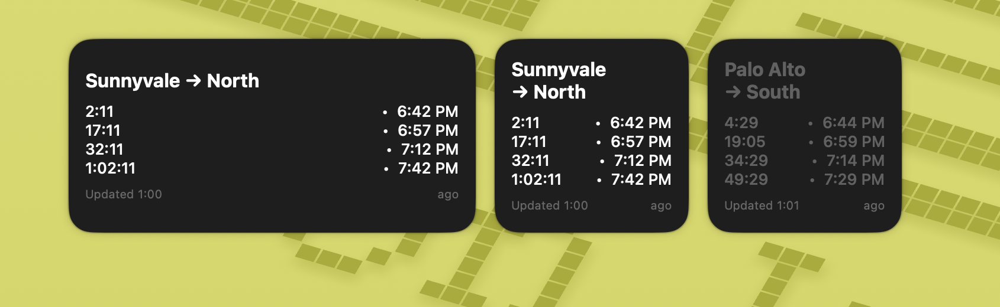

# Caltrain Departure Widgets for Scriptable

Real-time Caltrain departure tracking widgets for iOS using [Scriptable](https://scriptable.app/). Display live train times directly on your iPhone home screen with automatic updates and smart time-based dimming.



## Features

- **Real-time Updates**: Live countdown timers that update continuously, even between widget refreshes
- **Smart Dimming**: Automatically dims the less relevant widget based on time of day
  - Before noon: Southbound widget is bright, Northbound is dimmed
  - After noon: Northbound widget is bright, Southbound is dimmed
- **Visual Indicators**: Departed trains appear in light red to distinguish from upcoming trains
- **Dynamic Timers**: Shows accurate time until departure, never stale even when iOS delays widget refreshes
- **Data Source**: Uses official 511.org transit API for reliable Caltrain schedules

## Requirements

- iOS device (iPhone or iPad)
- [Scriptable app](https://apps.apple.com/us/app/scriptable/id1405459188) (free)
- 511.org API key ([get one here](https://511.org/open-data/token))

## Installation

1. **Install Scriptable** from the App Store
2. **Get a 511.org API key** (free):
   - Visit https://511.org/open-data/token
   - Sign up and generate an API key
3. **Add the scripts**:
   - Copy `Palo Alto South.js` into Scriptable
   - Copy `Sunnyvale North.js` into Scriptable
   - Update the `API_KEY` constant in both files with your key
4. **Add widgets to your home screen**:
   - Long press on home screen → tap "+" → find Scriptable
   - Add small widgets and select the corresponding script for each

## Configuration

### Customizing Stations

Each script has a `STOP_ID` constant that determines which station to monitor:

```javascript
const STOP_ID = "70221";   // Sunnyvale North
const STOP_ID = "70172";   // Palo Alto southbound platform
```

To monitor different stations, find your stop ID from the [511.org documentation](https://511.org/open-data/transit).

### Adjusting Number of Departures

Change the `NUM_RESULTS` constant to show more or fewer trains:

```javascript
const NUM_RESULTS = 4;  // Shows up to 4 upcoming trains
```

### Customizing Dimming Times

Modify the dimming logic in the `createWidget()` function:

```javascript
// Example: Dim before 9 AM instead of noon
const isDimmed = currentHour < 9;
```

### Changing Colors

- **Normal text**: Modify `Color.white()` calls
- **Past trains**: Change `new Color("#FF8888")` to your preferred light red
- **Background**: Update `w.backgroundColor = new Color("#1E1E1E")`

## How It Works

1. Fetches live departure data from 511.org's SIRI StopMonitoring API
2. Filters for relevant directions (northbound to SF or southbound to San Jose/Gilroy)
3. Displays countdown timers using Scriptable's dynamic date formatting
4. Refreshes every minute, but timers update continuously in real-time
5. Automatically dims the less relevant widget based on time of day

## Troubleshooting

**Widget shows "No live trains"**
- Check your API key is valid
- Verify the STOP_ID is correct for your station
- Ensure you have internet connectivity

**Times seem inaccurate**
- The countdown timers update continuously and should always be accurate
- Check that your device's time/timezone is set correctly

**Widget not refreshing**
- iOS controls widget refresh schedules to save battery
- Timers still update in real-time even if data isn't re-fetched
- The "Updated X ago" indicator shows when data was last refreshed

## API Rate Limits

The 511.org API has rate limits for free tier users. These scripts refresh every minute, which should be well within limits for personal use.

## License

MIT License - see [LICENSE](LICENSE) file for details

## Credits

- Uses [511.org Open Data API](https://511.org/open-data)
- Built with [Scriptable](https://scriptable.app/) by Simon Støvring
- Caltrain schedules provided by Caltrain
